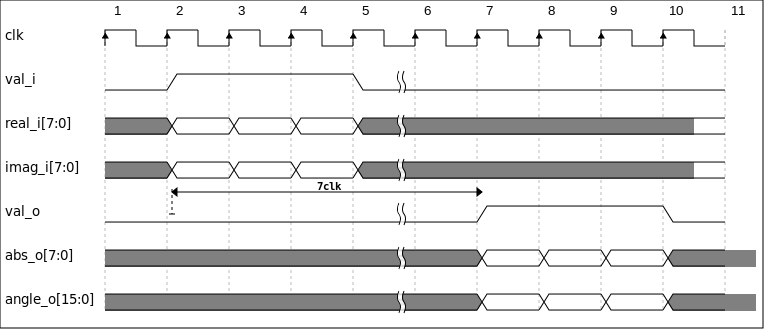
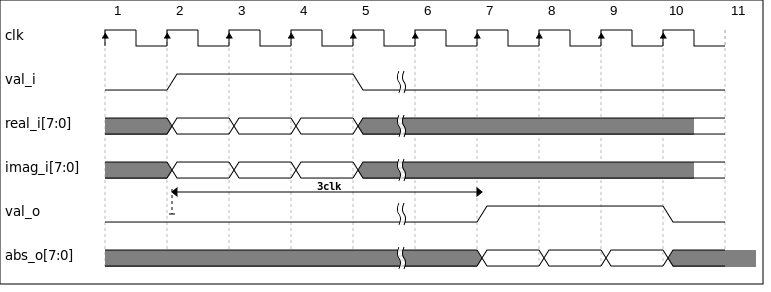
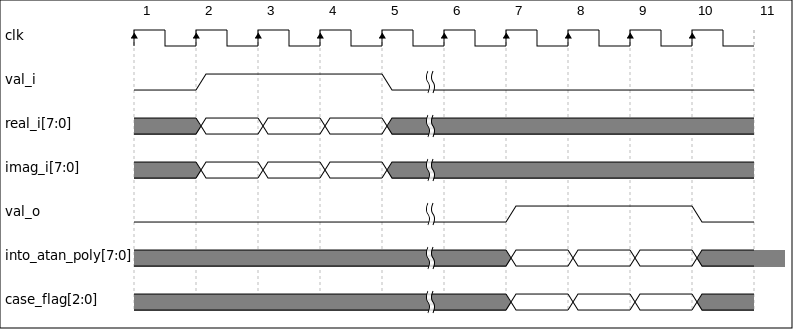
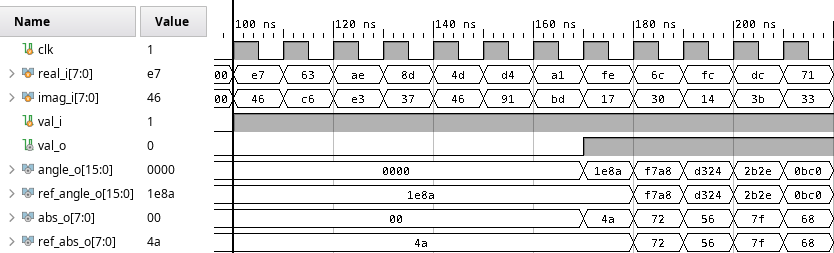
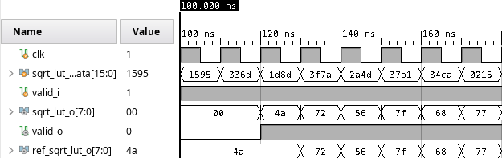
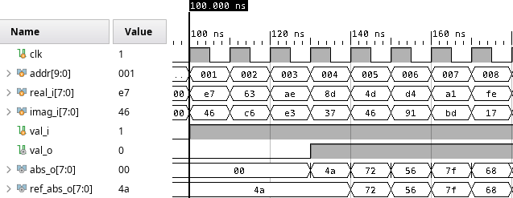
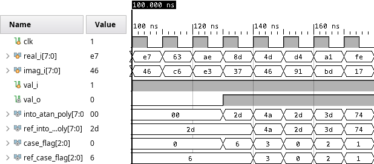
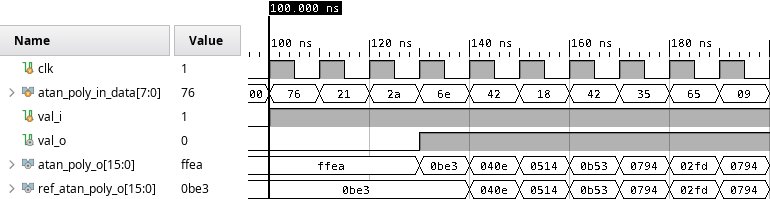
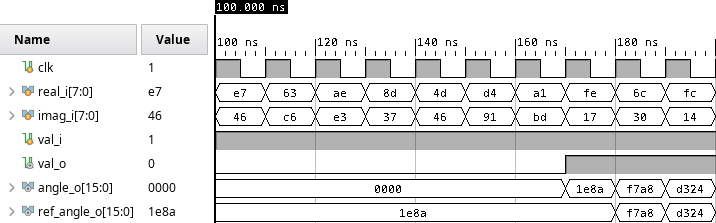

# 复数模值及幅角计算模块设计
本设计旨在设计、仿真硬件计算复数模值及幅角。
## 1 算法原理
计算复数模值及幅角会涉及到复杂函数计算，在模值计算中对应平方根函数，在幅角计算中对应反正切函数:

$$abs(a+bi) = \sqrt{a^2 +b^2} $$

$$angle(a+bi) = atan(b / a) $$

在FPGA中实现此类复杂函数计算，有几种不同方法，一是近似计算，二是拟合法，三是线性插值法，四是迭代法。本设计中，线性插值法和拟合法分别实现平方根函数及反正切函数。

### 1.1 平方根函数之线性插值实现原理
线性插值法即用若干段直线接近复杂曲线，如此可用乘法、加法运算计算复杂函数值。一般而言，直线段越多误差越小，但段数太多会给计算资源带来压力。故在设计硬件前需仿真确定段数，平衡性能与资源。

### 1.2 反正切函数之拟合实现原理
拟合法基于泰勒展开原理:

$$ f(x) = \sum_{n=0}^{\infty} \frac{f^{(n)}(a)}{n!} (x-a)^n $$

即用多项式函数叠加接近复杂函数，将复杂函数计算转化为乘法、加法运算。多项式次数越高，误差越小，但乘法次数也会增加，带来资源上的压力。由于[0,1]范围内反正切函数斜率变化不大，较为适合用此二阶拟合方法。

## 2 模块说明

### 2.1 系统整体结构

如图所示整个系统由两大模块组成，一是计算幅角的CalAngle模块，二是计算模值的CalAbs模块。输入数据是复数的实部和虚部，为8位有符号数，小数位为7位。二者并行运算同时输出16位有符号幅角值和8位无符号模值。系统整体延迟为7个周期。

### 2.2 模值计算模块

如图所示，CalAbs模块（模值计算模块）中嵌套了sqrt_lut模块，后者即通过线性插值计算平方根函数，其中包含提前计算得到的1024段直线斜率和截距，按升序存入ROM ip:k_rom和b_rom。输入实部和虚部分别平方运算再相加得到平方和，输入至sqrt_lut模块，其高10位作为地址输入两ROM模块，得到相应直线段的斜率和截距，再乘加计算得到8bit开方值。整体延迟为3个周期。

### 2.3 幅角计算模块

如图所示，CalAngle模块（幅角计算模块）划为了两部分：PatternMatch和AtanPoly，延迟为7个周期。后者完成二阶拟合计算，前者负责检测输入实部虚部正负、比较两者绝对值大小，保证CalAngle的输入数据在[0,1]范围内。具体而言，硬件实现反正切函数有两主要问题。一是虚部除以实部后，CalAngle的输入数据理论上可接近无穷，位宽不得不随值增大；二是反正切函数自变量对应多值问题，需根据实部虚部正负值判断函数值在哪段曲线上。

利用三角函数互余特性，结合实部正负判断，可解决上述两问题。如上图所示，将反正切函数分为a、b、c、d、e、f、g六段：

$$a:\operatorname{atan}\left(\frac{y}{x}\right), \quad \frac{y}{x} \in [0, 1]$$
$$b:-\operatorname{atan}\left(\frac{x}{y}\right)+\frac{\pi}{2}, \quad \frac{y}{x} \in (1, +∞)$$
$$c:-\operatorname{atan}\left(-\frac{y}{x}\right), \quad \frac{y}{x} \in (-1, 0)$$
$$d:\operatorname{atan}\left(-\frac{x}{y}\right)-\frac{\pi}{2}, \quad \frac{y}{x} \in (-∞, -1)$$
$$e:\operatorname{atan}\left(\frac{y}{x}\right)-\pi, \quad \frac{y}{x} \in [0, 1]$$
$$f:\operatorname{atan}\left(\frac{x}{y}\right)-\frac{\pi}{2}, \quad \frac{y}{x} \in (1, +∞)$$
$$g:-\operatorname{atan}\left(-\frac{y}{x}\right)+\pi, \quad \frac{y}{x} \in (-1, 0)$$
$$h:\operatorname{atan}\left(-\frac{x}{y}\right)+\frac{\pi}{2}, \quad \frac{y}{x} \in (-∞, -1)$$

其中x为实部，y为虚部。可知，a、b、c、d段只在实部大于零时成立，e、f、g、h段在实部小于零时成立。实部等于零时，再根据虚部正负情况判断。除此之外，易得a段与剩余段之间的关系，故可只拟合自变量在[0,1]的a段，用其表示剩下五段。

故设计了PatternMatch模块，其根据实部虚部正负及绝对值大小配置后续计算模式，时序如下图所示，其中into_atan_poly[7:0]为输入atan_poly信号，case_flag指示上述八种情况中的一种：

## 3 性能指标
### 3.1 精度及资源指标 
#### 3.1.1计算误差
由于本题并未给出具体误差指标，本设计自行设计模值、幅角最大相对误差为1%。首先在MATLAB设计拟合、插值阶段即划定了误差上限。如表所示

|| 模值计算误差|幅角计算误差 |
|:---|:---:|:---:|
|MATLAB设计| 0.78%|0.67% |
|C++软件仿真|0.78%|0.36% |
|Verilog仿真| 0.78%|0.36% |

### 3.1.2 资源占用

|          Site Type         | Used | Util% |
|----------------------------|------|-------|
| Slice LUTs                 |  143 |  1.79 |
| Slice Registers            |  123 |  0.77 |
| MUL IP                     |    6 |  NULL |   
| BRAM IP                    |    1 |  NULL |   
| DIV IP                     |    1 |  NULL |   

### 3.2 速度指标
结合上述，模值计算延迟为3个周期，幅角运算延迟为7个周期，经时序对齐，系统整体延迟为7个周期。结合综合工具给出的时序综合结果：

Clock | Edges (WNS) | WNS (ns) | WHS (ns) | WPWS (ns) |
----- | ----- | ----- |----- | ----- |
clk | rise - rise | 0.042 | 0.065 | 4.416 |

由
$$F_{max} = \frac{1}{(T-WNS)}$$
且
$$T = 10(ns)$$
可求
$$ F_{max} = 100.42 MHz $$
最终系统速度指标如下表所示：

| 最高工作频率|吞吐量 |延迟周期数|
|:---:|:---:|:---:|
|100.42Mhz|24bit/clk |7clk |

## 4 验证
### 4.1 验证方法
为保证软硬件验证的连续性，在设计过程中先用C++模拟出了定点数计算，将函数与硬件模块对应后导出了相应输入输出值，如此在编写testbench时可直接读取这些文件，分别作为激励和参照结果。并在testbench中一一比对仿真输出与软件输出结果，所有测试结果一致或误差在允许范围内者即打印输出“Test passed”。如此测试方法比看波形更高效，更完整。
### 4.2 验证结果
- CalAbsAngle验证结果

- SqrtLut验证结果

- CalAbs验证结果

- PatternMatch验证结果

- AtanPoly验证结果

- CalAngle验证结果

且在命令行内，上述所有测试均打印输出“Test passed”字样。

## 5 附件
### 5.1 模块代码

### 5.2 验证代码

​                 